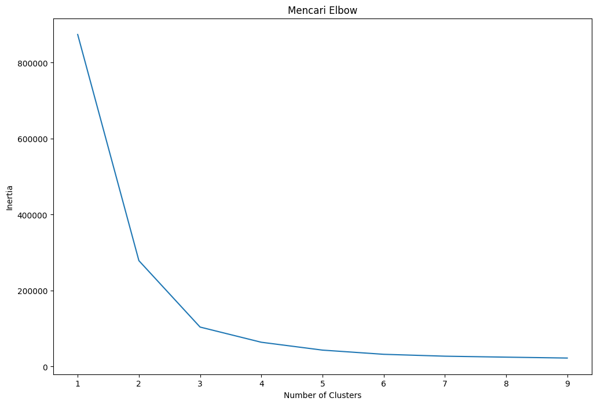

# Laporan Proyek Machine Learning

### Nama : Indra Setiawan

### Nim : 211351066

### Kelas : Pagi B

## Domain Proyek

Web app ini mengelompokan data nutrition starbucks. Pengelompokan ini menggunakan algorithma K-Means Clustering

## Business Understanding
Web app ini digunakan untuk memahami nutrition makanan yang ada di starbucks, agar saat memilih makanan kita bisa menentukan cocok untuk dipilih atau tidak

Bagian laporan ini mencakup:

### Problem Statements

Banyaknya yang tanpa sadar membuat pilihan makanan yang kurang sehat seperti asupan kalori berlebihan, konsumsi gula tinggi dan kurangnya kesadaran tentang alternatif yang lebih sehat

### Goals

Memahami opsi yang rendah kalori, rendah lemak, atau tinggi protein. Membuat daftar pilihan makanan sehat dan berpegang pada itu.

### Solution statements

- Membuat web app untuk mengelompokan secara otomatis menggunakan K-Means Clustering

## Data Understanding

Dataset original yang saya gunakan berasal dari Kaggle yang berisi tentang Starbucks nutrition facts.Dataset ini mengandung 77 baris dan 8 kategori.<br>

[Starbucks Nutrition Facts](https://www.kaggle.com/datasets/utkarshx27/starbucks-nutrition/data).

Selanjutnya menguraikan seluruh variabel atau fitur pada data

### Variabel-variabel pada  adalah sebagai berikut:

- Item                  :Menunjukan Nama item = object
- Calories              :Menunjukan Jumlah Calories = int64
- Fat                   :Menunjukan Jumlah Fat = float64
- Carb                  :Menunjukan Jumlah Carb = int64
- Fiber                 :Menunjukan Jumlah fiber = int64
- Protein               :Menunjukan Jumlah Protein = int64
- Type                  :Menunjukan Type item = object

## Data Preparation
Pertama kita mengupload data yang telah kita unduh dari kaggle

### Data Collection

Untuk data collection ini, saya mendapatkan dataset dari website kaggle

# Import Dataset
```bash
from google.colab import files
files.upload()
```
 Buat folder untuk menyimpan token yang tadi telah diupload

```bash
!mkdir -p ~/.kaggle
!cp kaggle.json ~/.kaggle/
!chmod 600 ~/.kaggle/kaggle.json
!ls ~/.kaggle
```
```bash
!kaggle datasets download -d utkarshx27/starbucks-nutrition
```
# Extract File

Extract file yang tadi di unduh lalu masukan kedalam folder
```bash
!mkdir starbucks-nutrition
!unzip starbucks-nutrition.zip -d starbucks-nutrition
!ls starbucks-nutrition
```
Selesai

# Import Libary
```bash
import seaborn as sns
import pandas as pd
from matplotlib import pyplot as plt
import numpy as np
from sklearn.cluster import KMeans
from sklearn.preprocessing import LabelEncoder
```
# Data Discovery
```bash
df = pd.read_csv('/content/starbucks-nutrition/starbucks.csv')
```
Ini adalah data - data kandungan nutrion starbuck

```bash
df.head()
```

```bash
df.describe()
```

```bash
df.info()
```

```bash
df.isnull().sum()
```
# EDA

```bash
sns.heatmap(df.isnull())
```


```bash
plt.figure(figsize=(10,8))
sns.heatmap(df.corr(), annot=True)
```


```bash
sns.catplot(kind='bar',x='type',y='calories',data=df)
plt.title('Calories in Items')
```

sandwich mengandung calories paling tinggi

```bash
sns.catplot(kind='bar',x='type',y='fat',data=df)
plt.title('Fats in Items')
```

disini bistro box mengandung fat paling banyak

```bash
sns.catplot(kind='bar',x='type',y='protein',data=df)
plt.title('Protein in Items')
```

yang paling banyak menganduk protein ada di sandwich

```bash
sns.catplot(kind='bar',x='type',y='fiber',data=df)
plt.title('Fibers in Items')
```

wow disini bisto box mengandung fiber paling tinggi di antara lainnya

# Preprocessing
Disini kita akan drop(menghapus) data Unnamed: 0,item dan mengubah data type menjadi int

```bash
le=LabelEncoder()
df['type']=le.fit_transform(df['type'])
```

```bash
df.info()
```
Data type sudah berubah menjadi int

```bash
x = df.drop(['Unnamed: 0','item'], axis=1)
```

```bash
print(x)
```
Berhasil mengahapus data unnamed: 0 dan item

Lalu kita cari elbownya
```bash
clusters = []
for i in range(1, 10):
    km = KMeans(n_clusters=i).fit(x)
    clusters.append(km.inertia_)

fig, ax = plt.subplots(figsize=(12, 8))
sns.lineplot(x=list(range(1, 10)), y=clusters, ax=ax)
ax.set_title('Mencari Elbow')
ax.set_xlabel('Number of Clusters')
ax.set_ylabel('Inertia')
plt.show()
```

kita telah menemukan angka 2 dan 3 sebagai elbownya, lalu kita gunakan angka 3 sebagai K

# Modeling
Disini kita akan mengelompokan data(cluster)

```bash
n_clust = 3
kmean = KMeans(n_clusters=n_clust).fit(x)
x['Labels'] = kmean.labels_
```

```bash
plt.figure(figsize=(10, 8))

sns.scatterplot(x='fat', y='carb', hue='Labels', size='Labels', markers=True, palette=sns.color_palette('hls', n_colors=n_clust), data=x)

for label in x['Labels']:
    plt.annotate(label,
                 (x[x['Labels'] == label]['fat'].mean(),
                  x[x['Labels'] == label]['carb'].mean()),
                 horizontalalignment='center',
                 verticalalignment='center',
                 size=20, weight='bold',
                 color='yellow')

plt.show()
```


```bash
plt.figure(figsize=(10, 8))

sns.scatterplot(x='carb', y='calories', hue='Labels', size='Labels', markers=True, palette=sns.color_palette('hls', n_colors=n_clust), data=x)

for label in x['Labels']:
    plt.annotate(label,
                 (x[x['Labels'] == label]['carb'].mean(),
                  x[x['Labels'] == label]['calories'].mean()),
                 horizontalalignment='center',
                 verticalalignment='center',
                 size=20, weight='bold',
                 color='yellow')

plt.show()
```


```bash
plt.figure(figsize=(10, 8))

sns.scatterplot(x='fat', y='calories', hue='Labels', size='Labels', markers=True, palette=sns.color_palette('hls', n_colors=n_clust), data=x)

for label in x['Labels']:
    plt.annotate(label,
                 (x[x['Labels'] == label]['fat'].mean(),
                  x[x['Labels'] == label]['calories'].mean()),
                 horizontalalignment='center',
                 verticalalignment='center',
                 size=20, weight='bold',
                 color='yellow')

plt.show()
```

Data-datanya sudah kita cluster/kelompokkan

Lalu kita lihat data

```bash
print(x)
```

# Deployment
[Cluster Starbuck Nutrition](https://clustering-strabuck-nutrition-indra.streamlit.app/)<br>
